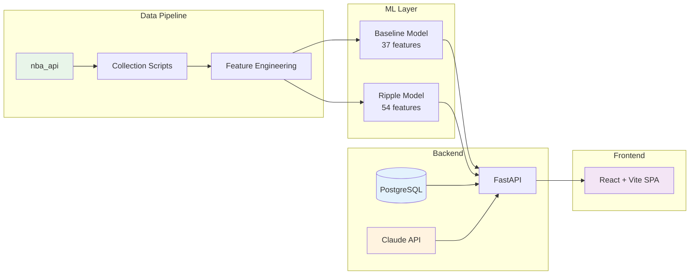

# NBA Injury Impact Analyzer

> Predicting how NBA injuries cascade through team performance — powered by machine learning and 4 seasons of historical data

[](https://www.python.org/)
[](https://fastapi.tiangolo.com/)
[](https://react.dev/)
[](https://scikit-learn.org/)
[](https://www.anthropic.com/)
[](https://www.postgresql.org/)
[](https://railway.app/)
[](https://vercel.com/)

**[Live Demo](https://nba-injury-impact.vercel.app)** · **[API Docs](https://web-production-04edf.up.railway.app/docs)**

[Screenshot placeholders - will be added]

---

## What Makes This Different

Most sports prediction tools treat players in isolation — predict a stat line, show a projection, done. This project models what happens to *everyone else* when a key player goes down. The **Injury Ripple Effect** is the headline feature: when a starter is ruled out, the system quantifies how remaining teammates' stats shift — more minutes, more shot attempts, changed roles — using a dedicated delta model trained on 90K+ player-game samples. Beyond static predictions, an **AI Scenario Engine** powered by Claude lets users ask natural-language questions ("How does LeBron's absence affect Austin Reaves?") and get answers grounded in real model outputs, not generic chatbot responses.

## Features

### Injury Ripple Effect

The core feature. Select any upcoming game, and the system detects which players are absent from each team's rotation. It then runs a two-model pipeline — baseline predictions assuming full health, then injury-adjusted predictions using 17 engineered absence features — and surfaces the *delta* as the ripple effect. For example, if a team's primary ball handler is out, the model might project the backup point guard gaining +3.2 points and +1.8 assists while the center sees +2.1 rebounds from longer rotations.

### Baseline Player Predictions

Every player on an upcoming game's roster gets a stat projection (points, assists, rebounds, steals, blocks, minutes, FG%, FT%) built from rolling averages, matchup history, home/away splits, and trend features — 37 features total, no injury context involved.

### AI Scenario Chat

Ask questions in plain English. The chat routes intelligently: same-team queries pull live predictions from the ML pipeline and inject them as context for Claude, while cross-team or open-ended questions use season averages. Player name ambiguity is surfaced rather than silently guessed.

### Injury Simulator

A sandbox to test hypothetical scenarios. Pick any team, manually toggle players as absent, choose an opponent, and run the full prediction pipeline on demand. Useful for "what if" analysis before a game or exploring how different lineup configurations change projections.

### Dashboard

The main interface ties it all together — upcoming games with absence indicators, one-click game selection, baseline and ripple predictions displayed side-by-side with bar charts, and injury context badges showing which roles are missing and how much talent is lost.

## Architecture



- **Data Pipeline** — Python scripts pull game logs, rosters, and schedules from the NBA API, then engineer 73 columns of features with rolling averages, splits, and injury context.
- **ML Layer** — 16 HistGradientBoosting models (8 baseline + 8 ripple) trained on ~90K player-game rows across 3 NBA seasons.
- **Backend** — FastAPI serves predictions, caches results in PostgreSQL, handles Google OAuth, and proxies chat to the Claude API.
- **Frontend** — React SPA with Recharts visualizations, Tailwind styling, and responsive game/prediction views.

## ML Approach

**Model**: `HistGradientBoostingRegressor` (scikit-learn) — one model per target stat, 8 stats each for baseline and ripple (16 models total).

**Why this model**: The data is tabular with mixed numeric features. HistGradientBoosting handles NaN values natively (no imputation pipeline needed) and can capture non-linear interactions in the injury features. Evaluation showed minimal lift over Ridge regression for baseline predictions (<0.02 R²), confirming the relationships are largely linear — but the tree model is retained for its NaN handling and potential non-linear injury interactions.

**Feature set**: 37 baseline features (rolling averages, matchup history, home/away splits, position encoding, trend/context) + 17 injury features (starter absence flags, role-based indicators, talent loss metrics, lineup configuration experience) = 54 total for the ripple model.

**Ripple approach**: The system uses a **delta model** (Approach B) — trained to predict `actual_stat - season_average` using only the 17 injury features. At inference: `prediction = baseline + predicted_delta`. This was chosen over the full-model approach because median ripple sensitivity was 0.187 (below the 0.3 threshold), indicating injury signal is better isolated in a focused model.

### Evaluation Metrics (Test Set — 2024-25 Season)

| Stat | MAE | R² |
|------|-----|-----|
| Points | 4.53 | 0.54 |
| Assists | 1.33 | 0.51 |
| Rebounds | 1.89 | 0.45 |
| Minutes | 4.77 | 0.64 |
| FT% | 0.33 | 0.21 |
| Blocks | 0.52 | 0.19 |
| Steals | 0.73 | 0.10 |
| FG% | 0.18 | 0.09 |

Minutes and points are the most predictable stats. Percentage stats have inherently low signal due to single-game variance.

### Known Limitations

- **Percentage stats are noisy** — A player shooting 2/5 vs 3/5 creates a 20-percentage-point swing from tiny samples. Counting stats (points, assists, rebounds) are far more reliable predictions.
- **Counterfactual assumptions** — The ripple effect assumes "injuries zeroed = healthy team," but the model was trained with injury features at varying levels. Zeroing creates an input distribution the model hasn't exactly seen. Causal inference methods would provide cleaner counterfactuals.
- **Data freshness between refreshes** — Predictions reflect the last data pipeline run, not real-time stats. A daily refresh scheduler updates data at 6 AM EST, but mid-day lineup changes won't be reflected until the next cycle.
- **Early-season role drift** — Player roles are computed from cumulative season averages. Early in the season, small sample sizes can cause role assignments (primary scorer, ball handler, etc.) to differ from their stabilized values later in the season.

## Tech Stack

| Technology | Role |
|-----------|------|
| **Python 3.11** | Backend language — strong ML ecosystem, type hints throughout |
| **FastAPI** | API framework — auto-generated OpenAPI docs, Pydantic validation, async-compatible |
| **scikit-learn** | ML training and inference — HistGradientBoosting handles NaN natively, no preprocessing pipeline needed |
| **React 19** | Frontend framework — component-based UI with hooks for state management |
| **Vite** | Build tool — instant HMR in development, optimized production builds |
| **Tailwind CSS** | Styling — utility-first CSS, no custom stylesheet maintenance |
| **Recharts** | Data visualization — composable React chart components for stat comparisons |
| **Claude API** | AI chat — context-injected responses grounded in actual model predictions |
| **PostgreSQL** | Production database — prediction caching, user auth, chat rate limiting |
| **Railway** | Backend hosting — managed PostgreSQL, auto-deploys from GitHub |
| **Vercel** | Frontend hosting — edge CDN, auto-deploys from GitHub |

## Running Locally

### Prerequisites

- Python 3.11+
- Node.js 18+
- An [Anthropic API key](https://console.anthropic.com/) (optional — chat feature only)

### Backend

```bash
git clone https://github.com/YOUR_USERNAME/nba-injury-impact.git
cd nba-injury-impact

python -m venv venv
source venv/bin/activate        # Windows: venv\Scripts\activate

pip install -r requirements.txt

cp .env.example .env
# Edit .env — at minimum set ANTHROPIC_API_KEY for chat

uvicorn backend.api.main:app --reload --port 8000
```

The API will be available at `http://localhost:8000`. Interactive docs at `http://localhost:8000/docs`.

### Frontend

```bash
cd frontend
npm install
npm run dev
```

The frontend will be available at `http://localhost:3000` and proxies `/api` requests to the backend.

### Environment Variables

| Variable | Required | Description |
|----------|----------|-------------|
| `ANTHROPIC_API_KEY` | For chat | Claude API key for the AI chat feature |
| `DATABASE_URL` | No | Defaults to SQLite for local dev; set to PostgreSQL URL for production |
| `SECRET_KEY` | No | Session signing key (change in production) |
| `FRONTEND_URL` | No | CORS origin, defaults to `http://localhost:3000` |
| `GOOGLE_CLIENT_ID` | No | Google OAuth client ID (auth disabled without it) |
| `GOOGLE_CLIENT_SECRET` | No | Google OAuth client secret |
| `ADMIN_KEY` | No | Auth key for admin endpoints |

## Project Structure

```
nba-injury-impact/
├── backend/
│   ├── api/
│   │   ├── main.py                 # FastAPI app, lifespan, CORS, routers
│   │   ├── config.py               # Environment variable loading
│   │   ├── database.py             # SQLAlchemy models (users, cache, chat usage)
│   │   ├── data_access.py          # CSV data loading and player/team lookups
│   │   ├── schemas.py              # Pydantic request/response models
│   │   ├── player_resolver.py      # Fuzzy player name matching for chat
│   │   ├── scheduler.py            # Daily data refresh (APScheduler)
│   │   └── routes/
│   │       ├── predictions.py      # Baseline, ripple, and simulation endpoints
│   │       ├── players.py          # Player search and roster endpoints
│   │       ├── chat.py             # Claude-powered chat with context injection
│   │       ├── auth.py             # Google OAuth login/logout
│   │       └── admin.py            # Data refresh and cache management
│   ├── ml/
│   │   ├── baseline_model.py       # Baseline model training script
│   │   ├── ripple_model.py         # Ripple effect model training script
│   │   ├── predict.py              # Inference pipeline (lazy model loading)
│   │   ├── feature_builder.py      # Shared feature engineering (train = inference)
│   │   ├── config.py               # Model hyperparameters, feature lists, paths
│   │   └── MODEL_DOCS.md           # Detailed model documentation
│   ├── models/                     # Serialized model files (.joblib)
│   ├── data/
│   │   ├── raw/                    # CSV game logs, rosters, schedules
│   │   └── processed/              # Engineered features, feature dictionary
│   └── scripts/
│       ├── collect_player_stats.py # NBA API data collection
│       ├── collect_injury_data.py  # Player absence tracking
│       ├── collect_schedules.py    # Game schedule collection
│       └── process_data.py         # Feature engineering pipeline
├── frontend/
│   ├── src/
│   │   ├── pages/
│   │   │   ├── Dashboard.jsx       # Main game selection + predictions view
│   │   │   ├── Simulator.jsx       # Hypothetical injury scenario builder
│   │   │   └── Chat.jsx            # AI chat interface
│   │   ├── components/
│   │   │   ├── predictions/        # RippleTable, RippleChart, InjuryContextBadges
│   │   │   ├── games/              # GamesList, game selection cards
│   │   │   ├── layout/             # Navbar, page layout
│   │   │   └── ui/                 # LoadingSpinner, ErrorCard, EmptyState
│   │   ├── hooks/                  # useUpcomingGames, usePredictions, useSimulator
│   │   ├── services/               # Axios API client
│   │   ├── context/                # Auth context provider
│   │   └── utils/                  # Formatters, helpers
│   ├── package.json
│   └── vite.config.js
├── requirements.txt
├── Procfile                        # Railway deployment command
├── runtime.txt                     # Python version pin
└── .env.example                    # Environment variable template
```

## Disclaimer

This is a statistical analysis and portfolio project. Predictions are based on historical patterns and should not be used for gambling or betting decisions. Model outputs reflect correlations in past data, not guaranteed future outcomes.
